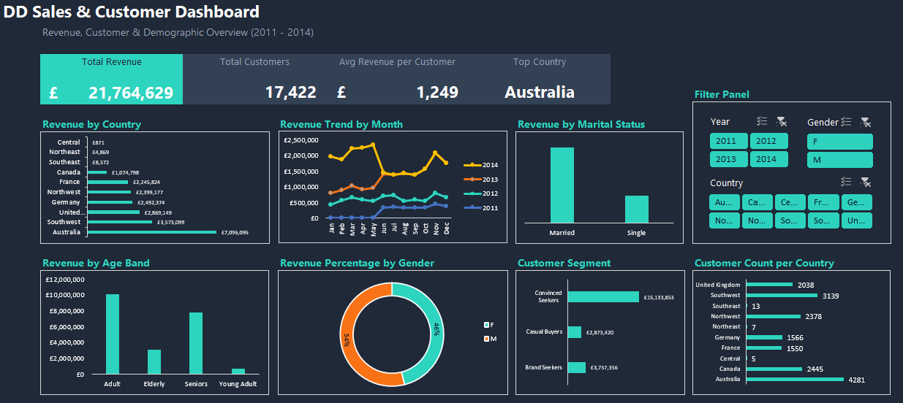

# DD Sales & Customer Analysis

## Project Overview

This project uses Microsoft Excel to analyse sales and customer data and identify patterns in revenue, customer behaviour, and demographics.

The project includes data preparation, Pivot Table analysis, and an interactive dashboard designed to provide a clear overview of sales performance and customer characteristics.

## Tools Used

- Microsoft Excel
- Excel Tables
- Pivot Tables
- Excel formulas
- Data visualisation
- Dashboard design

## Dataset

The dataset contains customer, demographic, order, and revenue information.

The analysis covers data from **2011 to 2014** and includes variables such as:

- Customer ID
- Gender
- Marital status
- Yearly income
- Revenue
- Customer value
- Order date
- Country
- Customer age
- Age band
- Customer name

Additional calculated fields were created to support the analysis, including year, year-month, weekday, month, customer age, age band, and customer segment.

## Business Questions

The analysis explores:

1. How is revenue distributed across countries?
2. How does revenue vary by gender?
3. How does revenue change over time?
4. Which customer age groups generate the most revenue?
5. How does revenue vary by marital status?
6. How can customers be grouped according to their purchasing value?
7. Which countries have the largest customer populations?
8. What overall patterns can be identified from the sales and customer data?

## Analysis Process

### Data Analysis

The data was prepared and enhanced with calculated fields to support further analysis.

Customer and sales information was organised into an Excel Table, allowing formulas and analysis to be applied consistently across the dataset.

### Pivot Table Analysis

Pivot Tables were used to summarise revenue and customer information across different dimensions, including:

- Country
- Gender
- Year
- Month
- Age band
- Marital status
- Customer segment
- Customer count

### Dashboard

An interactive dashboard was created to provide a high-level view of the analysis.

The dashboard includes:

- Total revenue
- Total customers
- Average revenue per customer
- Top country by revenue
- Revenue by country
- Revenue trends by month
- Revenue by marital status
- Revenue by age band
- Revenue percentage by gender
- Customer segments
- Customer count by country

- ## Dashboard Visualisation

## Key Findings

The analysis generated total revenue of approximately **$21.76 million** across **17,422 customers**.

Australia generated the highest revenue among the countries represented in the analysis, contributing approximately **$7.10 million**.

Male customers generated approximately **$11.74 million** in revenue, compared with approximately **$10.03 million** generated by female customers. These figures should be considered alongside the difference in the number of customers in each group.

Customer segmentation showed that **Convinced Seekers** generated the largest share of revenue, followed by **Brand Seekers** and **Casual Buyers**.

The analysis also revealed differences in revenue across age groups, marital status, countries, and time periods, providing a broader view of customer purchasing behaviour.

## Excel Skills Demonstrated

- Data cleaning and preparation
- Excel Tables
- Calculated columns
- Conditional formulas
- Date and text functions
- Pivot Tables
- Data aggregation
- Customer segmentation
- Revenue analysis
- Dashboard development
- Data visualisation
- Business-focused interpretation

## Project Files

- `DD Sales Dataset.xlsx` – Excel dataset containing the sales and customer data used for the analysis, pivot tables and dashboard.
- `DD_Sales_Dashboard.png` – Screenshot of the completed Excel dashboard.
- `README.md` – Project documentation, including the analysis overview, key findings, and recommendations.

## Conclusion

This project demonstrates my ability to use Excel to transform customer and sales data into structured analysis and business insights.

The combination of data preparation, calculated fields, Pivot Tables, and dashboard visualisation provided a practical way to investigate revenue performance and customer behaviour across multiple demographic and sales dimensions.

The project also demonstrates how Excel can be used not only for calculations, but also for communicating findings in a clear and business-oriented format.
